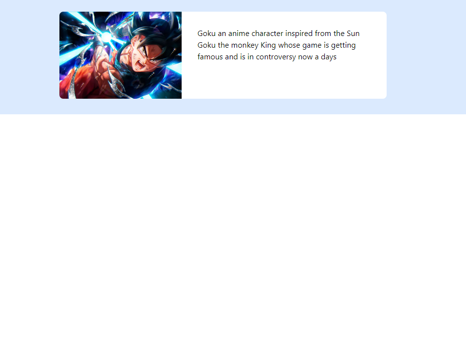

```markdown
## Tailwind Learning

### Example 3


If the `target="_blank"` attribute isn't working as expected within your GitHub README or another Markdown file, it's likely due to GitHub's restrictions on the HTML tags and attributes that can be used in Markdown files. GitHub, for security and consistency reasons, strips out certain attributes, including `target="_blank"`, when rendering Markdown files.

However, there are a few things to check and alternatives to consider:

### 1. GitHub's Markdown Rendering

- **Security Restrictions**: GitHub-flavored Markdown (GFM) is designed to be secure, so it sanitizes HTML input to prevent malicious code execution. This sanitization process might remove certain attributes like `target="_blank"` for security purposes.
- **Standard Markdown**: In a standard Markdown file on GitHub, all links will open in the same tab by default, and there is no native Markdown syntax to change this behavior.

### 2. Alternative Approaches

- **Informing Users**: If you're sharing a link and want users to open it in a new tab, you could add a note like "(Right-click and select 'Open in new tab')" next to the link.
- **Use in Webpages**: If you're using this in a context where Markdown is converted to HTML on a website you control (e.g., a static site generator like Jekyll or Hugo), you might have more control. In these cases, ensure your Markdown parser allows HTML and that `target="_blank"` isn't stripped.

### 3. Fallbacks for GitHub Markdown

Given the limitations, if you must use GitHub-flavored Markdown:

- Stick with simple Markdown links, understanding they'll open in the same tab.
- Provide instructions if it's important for the link to open in a new tab (e.g., for GitHub documentation or README files).

### Example with a Markdown Link

The output of this code:

```html
<div class="m-8 mx-auto items-center space-x-4 rounded-xl bg-blue-100 p-8">
  <div class="mt-4">
    <div class="mx-auto max-w-sm rounded-lg bg-white overflow-hidden md:max-w-2xl">
      <div class="md:flex">
        <div class="h-38 w-full object-cover md:h-full md:w-38">
          
        </div>
        <div class="p-8">
          Goku is an anime character inspired by Sun Goku, the Monkey King, whose game is getting famous and is in controversy nowadays.
        </div>
      </div>
    </div>
  </div>
</div>
```

Check out this [Click here](https://play.tailwindcss.com/cbIurC4yOe) to view the code behind.

Or visit directly:
[https://play.tailwindcss.com/cbIurC4yOe](https://play.tailwindcss.com/cbIurC4yOe)


```

### Conclusion

In a GitHub README, HTML attributes like `target="_blank"` won't work because of GitHub's security settings. You can use plain Markdown syntax for links, understanding that they'll open in the same tab, and suggest users open them in a new tab if needed. For websites where you have full control over HTML rendering, the `target="_blank"` attribute should work fine.


--> Just did this mini task in tailwindcssplay 

# 2
https://play.tailwindcss.com/27gUXRDLbM
````
<div class="container mx-auto">
  <h1 class="text-center text-2xl font-bold text-blue-700 sm:text-3xl md:text-4xl lg:text-5xl xl:text-6xl">Responsive Heading</h1>
  <p class="mt-4 text-sm text-gray-800 sm:text-base md:text-lg lg:text-xl xl:text-2xl">This paragraph changes its text size based on the screen width. Resize your browser to see the changes in action.</p>
  <div class="mt-6 grid grid-cols-1 gap-4 sm:grid-cols-2 md:grid-cols-3 lg:grid-cols-4">
    <div class="rounded bg-white p-4 shadow">Block 1</div>
    <div class="rounded bg-white p-4 shadow">Block 2</div>
    <div class="rounded bg-white p-4 shadow">Block 3</div>
    <div class="rounded bg-pink-100 p-4 shadow sm:bg-pink-300 md:bg-pink-500 xl:bg-pink-800">Change Color</div>
  </div>
</div>
````


# 1
https://play.tailwindcss.com/dVzzbogmE2

````
<!-- <div class="grid h-screen place-content-center">Hi There</div> -->

<div class="m-8 mx-auto flex max-w-sm items-center space-x-4 rounded-xl bg-blue-100 p-8 shadow-lg">
  <div>
    
  </div>
  <div>
    <div>
      <h1 class="text-3xl font-bold">AI Generated</h1>
      <p class="text-slate-500">Well It is not That Much of A Deal on Big Scale</p>
      
    </div>
  </div>
</div>

````
